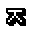
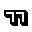

# 한글 슬랙 이모지

슬랙에서 사용하기 위해 만든 한글 이모지 모음입니다.

`32*32` 사이즈를 기준으로 제작되었고, `반응 추가`로 이모지를 추가할 경우에 표시되는 `16*16` 사이즈에 최적화 되어 있습니다.

다른 이모지가 필요하실 경우, [이슈](https://github.com/raycon/slack-emoji/issues)를 등록해주시면 감사하겠습니다.

## GIF

## PNG

